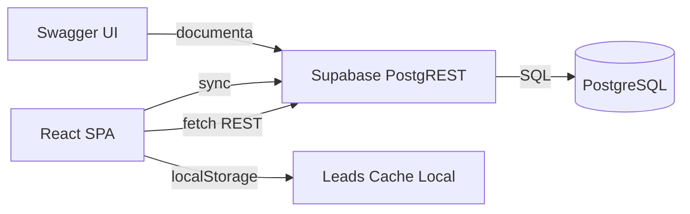

# Javeriana Lead & Events Manager — Plan de Implementación v2

## Contexto

Prueba técnica para el cargo de **Desarrollador Frontend** en la Dirección de Mercadeo de la Pontificia Universidad Javeriana. Se requiere una SPA que permita visualizar oferta académica y gestionar registro de leads.

**Plazo**: 28 de abril, 12:00 p.m. (quedan ~3 días)  
**Repositorio**: `JuanCastrejon/JaverianaLeadAndEventsManager`  
**Deploy**: Vercel (CLI autenticado como `juancastrejon`)  
**Supabase**: CLI autenticada

---

## Análisis del Sitio Web Javeriana (javeriana.edu.co)

> [!NOTE]
> Resultados del análisis de DOM, CSS y diseño del sitio oficial.

### Paleta de Colores Institucional

| Token | Color | Uso |
|-------|-------|-----|
| Azul Principal | `#003366` | Logo, headers, navbar, footer, botones primarios |
| Dorado Principal | `#C8A961` | Acentos, líneas decorativas bajo títulos, métricas |
| Dorado Brillante | `#FDB813` | Iconos, flechas de interacción, hover states |
| Fondo Principal | `#FFFFFF` | Contenido principal |
| Fondo Secciones | `#F8F9FA` | Separación visual entre secciones |
| Footer | `#003366` (azul) | Fondo del footer con texto/logo en blanco |

### Tipografía

- **Font principal**: `Open Sans`, `Helvetica Neue`, `Arial` (sans-serif)
- **Headings**: Bold, color azul `#003366`
- **Decoración**: Línea gruesa corta en dorado bajo títulos de sección
- **Cifras estadísticas**: Tamaño grande, color dorado `#C8A961`

### Patrones de Diseño Clave

| Elemento | Patrón |
|----------|--------|
| Header | Sticky, fondo blanco, sombra sutil en base, logo izquierda |
| Botones | Forma capsular (`border-radius: ~50px`), azul con texto blanco, icono `>>` |
| Cards | Imágenes de alto impacto, overlays oscuros/azules semi-transparentes, texto blanco |
| Footer | Azul profundo, logo blanco grande, contacto centrado, redes sociales |
| Tecnología | CMS Liferay, layout Flexbox + CSS Grid, responsive |

---

## Patrones del Proyecto Anterior (DesafioTecnicoFullStack)

> [!NOTE]
> Elementos a replicar/adaptar del proyecto previo.

| Patrón | Implementación previa | Adaptación |
|--------|----------------------|------------|
| Hero Section | Gradiente oscuro con métricas, kicker badge | Adaptar con colores Javeriana |
| CSS Variables | `:root` con `--gradient-start`, `--foreground`, etc. | Replicar con tokens Javeriana |
| Typography | `Space Grotesk` + `DM Sans` | Reemplazar por `Open Sans` (Javeriana) + una display |
| Cards | `surface-card` con hover lift + shadow | Adaptar con overlay pattern de Javeriana |
| Swagger UI | FastAPI custom swagger endpoint | Implementar Swagger UI standalone para Supabase |
| Supabase | PostgreSQL con seed de datos + Vercel deploy | Tabla de programas + tabla de leads |
| CI/CD | GitHub Actions con lint + test + build | Replicar para Vite + React + Vitest |
| Vercel | `vercel.json` con routes | Configurar para SPA |

---

## Arquitectura Propuesta

### Stack Tecnológico Final

| Capa | Tecnología | Justificación |
|------|------------|---------------|
| Framework | **Vite 6 + React 19** | SPA pura como pide la prueba |
| Lenguaje | **TypeScript (strict)** | Plus evaluativo explícito |
| Estilos | **Tailwind CSS 4** | Diseño diferenciado, dark mode nativo |
| Estado | **React Context + useReducer** | Alcance suficiente, demuestra gestión de estado |
| Backend/API | **Supabase** (PostgreSQL + REST auto) | API REST real, no mock |
| Documentación API | **Swagger UI standalone** | Documentación visual de endpoints |
| Animaciones | **Framer Motion** | Plus evaluativo |
| Testing | **Vitest + RTL** | Plus evaluativo |
| CI/CD | **GitHub Actions** | Plus evaluativo |
| Deploy | **Vercel** | Requerido por la prueba |

### Flujo de Datos



---

## Proposed Changes

### Componente 1: Scaffolding + Configuración Base

#### [NEW] Proyecto Vite + React + TypeScript
```bash
npx -y create-vite@latest ./ --template react-ts
```

#### [NEW] Dependencias
```bash
# Core
npm install @supabase/supabase-js framer-motion

# Estilos
npm install tailwindcss @tailwindcss/vite

# Swagger
npm install swagger-ui-react

# Testing
npm install -D vitest @testing-library/react @testing-library/jest-dom @testing-library/user-event jsdom

# Linting
npm install -D eslint @eslint/js typescript-eslint prettier
```

#### [NEW] `.env` y `.env.example`
```env
VITE_SUPABASE_URL=https://xxxxx.supabase.co
VITE_SUPABASE_ANON_KEY=eyJxxxxx
```

#### [NEW] `.gitignore` — Estándar Vite + Node + `.env`

#### [MODIFY] `.github/copilot-instructions.md` — Actualizar de Facturación DIAN a este proyecto

---

### Componente 2: Backend — Supabase

#### [NEW] Tabla `programs` (Supabase Dashboard o migración)

```sql
CREATE TABLE programs (
  id SERIAL PRIMARY KEY,
  name TEXT NOT NULL,
  description TEXT NOT NULL,
  category TEXT NOT NULL CHECK (category IN ('Pregrado', 'Posgrado', 'Educación Continua')),
  faculty TEXT NOT NULL,
  duration TEXT NOT NULL,
  modality TEXT NOT NULL CHECK (modality IN ('Presencial', 'Virtual', 'Híbrido')),
  credits INTEGER,
  image_url TEXT,
  created_at TIMESTAMPTZ DEFAULT NOW()
);
```

#### [NEW] Tabla `leads`

```sql
CREATE TABLE leads (
  id UUID DEFAULT gen_random_uuid() PRIMARY KEY,
  first_name TEXT NOT NULL,
  last_name TEXT NOT NULL,
  email TEXT NOT NULL,
  phone TEXT,
  program_of_interest TEXT NOT NULL,
  created_at TIMESTAMPTZ DEFAULT NOW()
);
```

#### [NEW] Seed de datos — 20-30 programas académicos reales de la Javeriana

Programas basados en la oferta real: Ingeniería de Sistemas, Medicina, Derecho, Administración, maestrías, especializaciones, diplomados, etc.

#### [NEW] Row Level Security (RLS)

```sql
-- Programs: lectura pública
ALTER TABLE programs ENABLE ROW LEVEL SECURITY;
CREATE POLICY "Programs are publicly readable" ON programs FOR SELECT USING (true);

-- Leads: inserción pública, lectura restringida
ALTER TABLE leads ENABLE ROW LEVEL SECURITY;
CREATE POLICY "Anyone can insert leads" ON leads FOR INSERT WITH CHECK (true);
CREATE POLICY "Leads readable with anon key" ON leads FOR SELECT USING (true);
```

---

### Componente 3: Servicio de API + Swagger

#### [NEW] `src/lib/supabase.ts`

```typescript
import { createClient } from '@supabase/supabase-js';
import type { Database } from '../types/database';

const supabaseUrl = import.meta.env.VITE_SUPABASE_URL;
const supabaseKey = import.meta.env.VITE_SUPABASE_ANON_KEY;

export const supabase = createClient<Database>(supabaseUrl, supabaseKey);
```

#### [NEW] `src/services/programService.ts`

```typescript
export async function fetchPrograms(): Promise<Program[]> {
  const { data, error } = await supabase
    .from('programs')
    .select('*')
    .order('name');
    
  if (error) throw new ApiError(error.code, error.message);
  return data;
}
```

#### [NEW] `src/services/leadService.ts`

```typescript
export async function createLead(lead: LeadFormData): Promise<Lead> {
  const normalized = normalizeLead(lead);
  const { data, error } = await supabase
    .from('leads')
    .insert(normalized)
    .select()
    .single();
    
  if (error) throw new ApiError(error.code, error.message);
  return data;
}

export async function fetchLeads(): Promise<Lead[]> {
  const { data, error } = await supabase
    .from('leads')
    .select('*')
    .order('created_at', { ascending: false });
    
  if (error) throw new ApiError(error.code, error.message);
  return data;
}
```

#### [NEW] `src/pages/SwaggerPage.tsx` — Swagger UI embebido

Swagger UI standalone consumiendo el OpenAPI spec de Supabase:
```
https://<project>.supabase.co/rest/v1/?apikey=<anon_key>
```

Esto proporciona una interfaz visual de documentación de API, similar a lo implementado en el proyecto anterior con FastAPI.

---

### Componente 4: Sistema de Diseño — Identidad Javeriana

#### [NEW] `src/index.css` — Tema Javeriana

```css
@import url('https://fonts.googleapis.com/css2?family=Open+Sans:wght@400;600;700&family=Playfair+Display:wght@700&display=swap');

@import "tailwindcss";

@theme {
  /* Colores institucionales Javeriana */
  --color-javeriana-blue: #003366;
  --color-javeriana-blue-light: #0a4d8c;
  --color-javeriana-blue-dark: #001f3f;
  --color-javeriana-gold: #C8A961;
  --color-javeriana-gold-bright: #FDB813;
  --color-javeriana-gold-light: #d4bc7e;
  
  /* Superficies */
  --color-surface: #FFFFFF;
  --color-surface-alt: #F8F9FA;
  --color-surface-dark: #0f1729;
  
  /* Tipografía */
  --font-family-body: 'Open Sans', sans-serif;
  --font-family-display: 'Playfair Display', serif;
}
```

#### [NEW] Componentes UI con identidad Javeriana

| Componente | Diseño |
|-----------|--------|
| `Button` | Capsular (border-radius alto), azul Javeriana + dorado hover, icono `>>` |
| `Card` | Imagen con overlay azul semi-transparente, texto blanco, hover lift |
| `Badge` | Pills por categoría con colores diferenciados |
| `Input` | Bordes suaves, focus ring dorado |
| `Header` | Sticky, fondo blanco, sombra sutil, logo SVG Javeriana |
| `Footer` | Fondo azul `#003366`, logo blanco, redes sociales |
| `SectionTitle` | Línea decorativa dorada bajo el título (patrón Javeriana) |

---

### Componente 5: Filtrado Avanzado (sin recarga)

#### [NEW] `src/hooks/usePrograms.ts`

- Fetch inicial desde Supabase
- Búsqueda por nombre con **debounce** (300ms)
- Filtro por categoría (Pregrado | Posgrado | Educación Continua | Todos)
- `useMemo` para filtrado eficiente
- `useCallback` para funciones estables
- Estados de loading/error/empty

#### [NEW] `src/components/programs/ProgramFilters.tsx`

- Input de búsqueda con ícono de lupa y clear button
- Tabs/Chips de categoría con contadores dinámicos
- Indicador de resultados filtrados
- Layout animation con Framer Motion

#### [NEW] `src/components/programs/ProgramGrid.tsx`

- Grid responsive: 1 col (mobile) → 2 (tablet) → 3 (desktop)
- Staggered entrance animation
- Empty state con ilustración
- Skeleton loading cards

#### [NEW] `src/components/programs/ProgramCard.tsx`

- Imagen con overlay azul gradiente
- Badge de categoría con color
- Información: nombre, facultad, duración, modalidad
- Hover: lift + sombra + detalle expandido

---

### Componente 6: Captura de Leads + Persistencia

#### [NEW] `src/utils/validators.ts`

```typescript
function validateEmail(email: string): ValidationResult {
  const emailRegex = /^[^\s@]+@[^\s@]+\.[^\s@]+$/;
  if (!emailRegex.test(email)) return { valid: false, message: 'Estructura de email inválida' };
  
  const isJaveriana = email.endsWith('@javeriana.edu.co');
  return { 
    valid: true, 
    warning: isJaveriana ? undefined : 'Se recomienda usar correo @javeriana.edu.co'
  };
}
```

#### [NEW] `src/utils/normalizers.ts`

```typescript
function normalizeLead(data: LeadFormData): LeadFormData {
  return {
    firstName: capitalize(data.firstName.trim()),
    lastName: capitalize(data.lastName.trim()),
    email: data.email.trim().toLowerCase(),
    phone: normalizePhone(data.phone.trim()),
    programOfInterest: data.programOfInterest,
  };
}
```

#### [NEW] `src/components/leads/LeadForm.tsx`

- Validación en tiempo real (onChange + onBlur)
- Visual feedback para dominio @javeriana.edu.co
- Select de programa de interés (poblado desde Supabase)
- Normalización automática al enviar
- Toast de éxito con datos normalizados
- Entrada animada con Framer Motion

#### [NEW] `src/hooks/useLocalStorage.ts`

Hook genérico tipado para persistencia dual:
- **localStorage** como cache inmediato (cumple requisito de la prueba)
- **Supabase** como persistencia remota (plus)
- Sincronización entre tabs con evento `storage`

#### [NEW] `src/context/LeadContext.tsx`

Context Provider con:
- `leads` (fuente: localStorage + Supabase)
- `addLead()` → escribe en localStorage + Supabase
- `removeLead()`, `clearLeads()`
- Estadísticas derivadas (total, por programa)

---

### Componente 7: Layout y Navegación SPA

#### [NEW] `src/App.tsx`

SPA con secciones ancladas (scroll-to-section):
1. **Hero** — Bienvenida + estadísticas de la Javeriana
2. **Programas** — Grid con filtros
3. **Inscripción** — Formulario de leads
4. **Leads Registrados** — Tabla de leads guardados
5. **API Docs** — Swagger UI embebido (accesible por nav)

#### [NEW] `src/components/layout/Header.tsx`

- Sticky con fondo blanco + sombra al scroll
- Logo Javeriana SVG
- Navegación por secciones (scroll suave)
- Toggle dark mode
- Hamburger responsive en mobile

#### [NEW] `src/components/layout/Footer.tsx`

- Fondo azul Javeriana `#003366`
- Logo en blanco
- Información de contacto
- Links de redes sociales

---

### Componente 8: Funcionalidades Plus

#### 🌙 Dark Mode
- ThemeContext + clase `dark` en `<html>`
- Respeta `prefers-color-scheme` como default
- Toggle en header con animación
- Persistido en localStorage
- Paleta oscura: superficies `#0f1729`, texto claro, dorado brillante

#### ✨ Animaciones (Framer Motion)
- Cards: staggered entrance (`variants` + `staggerChildren`)
- Formulario: slide-in lateral
- Filtros: layout animation al cambiar categoría
- Toast: slide-up con exit animation
- Scroll reveal para secciones
- Hero: fade-in secuencial de elementos

#### 🧪 Tests Unitarios (Vitest + RTL)

| Test | Qué valida |
|------|-----------|
| `validators.test.ts` | Email válido, @javeriana.edu.co, campos vacíos |
| `normalizers.test.ts` | Trim, capitalización, email lowercase |
| `useDebounce.test.ts` | Delay del debounce, valor actualizado |
| `ProgramCard.test.tsx` | Renderizado de datos, badge de categoría |
| `LeadForm.test.tsx` | Validación, envío, normalización |
| `programService.test.ts` | Mock de Supabase, manejo de errores |

#### 🔄 CI/CD (GitHub Actions)

```yaml
# .github/workflows/ci.yml
name: CI
on: [push, pull_request]
jobs:
  lint-test-build:
    runs-on: ubuntu-latest
    steps:
      - uses: actions/checkout@v5
      - uses: actions/setup-node@v5
        with: { node-version: 22, cache: npm }
      - run: npm ci
      - run: npx tsc --noEmit          # Type check
      - run: npx eslint src/           # Lint
      - run: npx vitest run --coverage  # Tests
      - run: npm run build             # Build verify
```

---

### Componente 9: Documentación y Entrega

#### [NEW] `README.md` — Profesional

Estructura:
1. Descripción del proyecto y screenshots
2. Demo en vivo (link Vercel)
3. Decisiones técnicas documentadas
4. Arquitectura y estructura de carpetas
5. Instrucciones para correr localmente
6. Stack tecnológico con justificaciones
7. Funcionalidades extra implementadas
8. Roadmap / mejoras futuras

---

## Estructura de Carpetas Final

```
├── .github/
│   ├── copilot-instructions.md     # Instrucciones del proyecto
│   └── workflows/ci.yml           # Pipeline CI
├── public/
│   └── javeriana-logo.svg          # Logo Javeriana
├── src/
│   ├── assets/                     # Imágenes estáticas
│   ├── components/
│   │   ├── ui/                     # Button, Input, Select, Badge, Card, Modal, Toast
│   │   ├── layout/                 # Header, Footer, Layout, SectionTitle
│   │   ├── programs/               # ProgramCard, ProgramGrid, ProgramFilters, ProgramDetail
│   │   ├── leads/                  # LeadForm, LeadList, LeadStats
│   │   └── swagger/                # SwaggerView
│   ├── context/                    # ProgramContext, LeadContext, ThemeContext
│   ├── hooks/                      # usePrograms, useLeads, useLocalStorage, useDebounce, useTheme
│   ├── lib/                        # supabase.ts (cliente)
│   ├── services/                   # programService.ts, leadService.ts
│   ├── types/                      # program.ts, lead.ts, database.ts
│   ├── utils/                      # validators.ts, normalizers.ts, constants.ts
│   ├── __tests__/                  # Tests unitarios
│   ├── App.tsx
│   ├── main.tsx
│   └── index.css                   # Tailwind + tema Javeriana
├── supabase/                       # Migraciones SQL + seed
│   └── migrations/
│       ├── 001_create_programs.sql
│       ├── 002_create_leads.sql
│       └── 003_seed_programs.sql
├── .env.example
├── .gitignore
├── index.html
├── package.json
├── tsconfig.json
├── vite.config.ts
├── vitest.config.ts
└── README.md
```

---

## Cronograma de Trabajo

| # | Fase | Estimación | Entregable |
|---|------|-----------|------------|
| 1 | Scaffolding Vite + Tailwind + TS | 30 min | Proyecto funcional con dev server |
| 2 | Supabase: tablas + seed + RLS | 45 min | API REST lista con datos reales |
| 3 | Sistema de diseño Javeriana + componentes UI | 1.5 hrs | Primitivos con identidad visual |
| 4 | Layout: Header, Footer, Hero, Secciones | 1 hr | Estructura SPA completa |
| 5 | Vista de programas + filtrado avanzado | 1.5 hrs | Grid + búsqueda + filtro |
| 6 | Formulario de leads + validaciones + normalización | 1.5 hrs | Formulario completo |
| 7 | Persistencia localStorage + Supabase sync | 45 min | Dual persistence |
| 8 | Dark mode + animaciones Framer Motion | 1 hr | Plus features |
| 9 | Swagger UI embebido | 30 min | Documentación API |
| 10 | Tests unitarios (Vitest) | 1 hr | 6+ test suites |
| 11 | CI/CD + README + Deploy | 45 min | Pipeline + docs + Vercel live |

**Total estimado**: ~10.5 horas de desarrollo

---

## Verification Plan

### Automated Tests
```bash
npx tsc --noEmit          # Zero type errors
npx eslint src/           # Zero lint issues
npx vitest run --coverage  # All tests pass, >70% coverage
npm run build             # Production build successful
```

### Browser Testing
- [ ] Filtrado en tiempo real (búsqueda + categoría) sin recarga
- [ ] Formulario: validaciones, warning @javeriana.edu.co, normalización
- [ ] Persistencia: recargar → leads siguen ahí (localStorage)
- [ ] Supabase: leads aparecen en dashboard remoto
- [ ] Dark mode: toggle + persistencia + respeta preferencia sistema
- [ ] Responsive: 375px (mobile), 768px (tablet), 1280px (desktop)
- [ ] Animaciones: entrada cards, transiciones, toasts
- [ ] Swagger UI: endpoints documentados y probables

### Deploy
```bash
git remote add origin https://github.com/JuanCastrejon/JaverianaLeadAndEventsManager.git
git add . && git commit -m "feat: initial implementation" && git push -u origin main
# Vercel auto-deploy via git integration
```

---

## Skills Aplicadas

| Skill | Uso en este proyecto |
|-------|---------------------|
| `frontend-design` | Identidad visual Javeriana, diseño premium dashboard |
| `tailwind-css-patterns` | Sistema responsive, dark mode, design tokens |
| `vercel-react-best-practices` | useMemo, useCallback, performance, Suspense |
| `typescript-advanced-types` | Interfaces estrictas, generics para servicios, discriminated unions |
| `vitest` | Tests unitarios con cobertura |
| `deploy-to-vercel` | Deploy producción del proyecto |
| `playwright-best-practices` | E2E tests opcionales si el tiempo lo permite |

---

## Plan de Implementación por Fases (Ejecución Intensiva en 1 Día)

> [!IMPORTANT]
> Objetivo dual: 1) asegurar cumplimiento impecable del núcleo requerido, 2) maximizar puntaje por funcionalidades plus sin comprometer estabilidad de la entrega.

### Estrategia de Priorización

| Prioridad | Alcance | Regla de decisión |
|-----------|---------|-------------------|
| P0 (Obligatorio) | Requisitos funcionales oficiales de la prueba | Debe quedar terminado antes de pasar a plus |
| P1 (Plus de alto impacto) | TypeScript estricto, Supabase real, UI sobresaliente, tests, CI/CD | Se implementa tras cerrar P0 |
| P2 (Plus opcional) | Swagger embebido, animaciones avanzadas, refinamientos visuales extra | Solo si P0 + P1 están estables |

### Fase 0 — Kickoff y Base Técnica (45 min)

**Objetivo**: dejar entorno reproducible, estructura limpia y decisiones congeladas.

**Incluye**:
- Scaffolding Vite + React + TypeScript strict.
- Integración Tailwind CSS 4.
- Configuración de variables de entorno y validación temprana.
- Estructura de carpetas base alineada al plan.

**Entregables**:
- Proyecto arranca en local sin errores.
- Build inicial y type-check exitosos.

**Criterio de salida (DoD)**:
- `npm run dev` levanta correctamente.
- `npx tsc --noEmit` sin errores.

### Fase 1 — Supabase Productivo (90 min)

**Objetivo**: asegurar API real desde el inicio, con datos de programas y seguridad mínima viable.

**Incluye**:
- Creación de tablas `programs` y `leads`.
- Seed inicial de 20-30 programas.
- Activación de RLS.
- Políticas para lectura pública de programas e inserción de leads.
- Vista de administración remota de leads para el dashboard (lectura controlada para la UI administrativa).

**Recomendación de seguridad para vista remota**:
- Mantener `leads` para escritura.
- Exponer vista de consulta para dashboard con campos mínimos (enmascarados si aplica) en lugar de abrir lectura completa de datos sensibles.

**Entregables**:
- Endpoints REST de Supabase funcionales.
- Datos reales disponibles para consumo del frontend.

**Criterio de salida (DoD)**:
- `programs` responde por REST en orden alfabético.
- Inserción de `leads` funciona desde cliente.
- Consulta administrativa remota disponible para la vista de leads.

### Fase 2 — Núcleo UI SPA (P0) (120 min)

**Objetivo**: completar requerimientos obligatorios visibles en una SPA navegable.

**Incluye**:
- Layout principal: Header, Hero, sección Programas, sección Inscripción, sección Leads.
- Listado de programas en cards.
- Búsqueda por nombre y filtro por categoría sin recarga.
- Responsive completo (mobile/tablet/desktop).

**Entregables**:
- Flujo visual completo del producto.
- UX base consistente con identidad Javeriana.

**Criterio de salida (DoD)**:
- Filtrado y búsqueda funcionan en vivo.
- Sin recargas completas entre interacciones.
- Diseño usable en 375px, 768px y 1280px.

### Fase 3 — Formulario de Leads (Local + Remoto) (120 min)

**Objetivo**: cumplir validaciones, normalización y persistencia dual.

**Incluye**:
- Validación de email + recomendación de dominio `@javeriana.edu.co`.
- Normalización (trim, capitalización, lowercase email).
- Persistencia obligatoria en localStorage.
- Envío simultáneo a Supabase para persistencia remota.
- Vista administrativa de leads con datos remotos y fallback local.

**Entregables**:
- Registro de lead robusto y persistente.
- Tabla/listado administrativo con información sincronizada.

**Criterio de salida (DoD)**:
- Recarga de navegador mantiene leads (localStorage).
- Lead creado aparece en Supabase.
- Vista de leads remotos funciona sin romper la UX.

### Fase 4 — Plus de Alto Puntaje (90 min)

**Objetivo**: subir calificación técnica y visual sin riesgo de regresión en P0.

**Incluye**:
- Dark mode persistente.
- Animaciones clave con Framer Motion (entrada, filtros, cards, formulario).
- Microinteracciones de alto impacto visual.

**Entregables**:
- Experiencia diferencial frente a una solución estándar.

**Criterio de salida (DoD)**:
- Toggle dark mode estable y persistente.
- Animaciones fluidas sin bloquear interacción.

### Fase 5 — Calidad Técnica y Evidencia (90 min)

**Objetivo**: blindar la entrega con validación automática y documentación.

**Incluye**:
- Tests unitarios prioritarios (validadores, normalizadores, hooks y servicios).
- Pipeline CI (lint + type-check + test + build).
- README final con decisiones técnicas y guía de ejecución.

**Entregables**:
- Evidencia objetiva de calidad.

**Criterio de salida (DoD)**:
- `npx tsc --noEmit` OK.
- `npx eslint src/` OK.
- `npx vitest run --coverage` OK.
- `npm run build` OK.

### Fase 6 — Swagger y Cierre de Entrega (45 min)

**Objetivo**: cerrar con documentación API visible y despliegue final.

**Incluye**:
- Integración de Swagger UI embebido (como plus).
- Deploy en Vercel.
- Verificación funcional post-deploy.
- Push final del repositorio con commits limpios.

**Entregables**:
- URL pública funcional (app).
- Repositorio público con README completo.

**Criterio de salida (DoD)**:
- App y vistas principales funcionando en producción.
- Enlace de repositorio + enlace de deploy listos para enviar.

### Cronograma Ejecutable de 1 Día (Referencia)

| Bloque | Duración | Fase | Resultado esperado |
|--------|----------|------|--------------------|
| B1 | 45 min | Fase 0 | Base técnica lista |
| B2 | 90 min | Fase 1 | Supabase operativo |
| B3 | 120 min | Fase 2 | Núcleo SPA completo |
| B4 | 120 min | Fase 3 | Leads local + remoto + admin |
| B5 | 90 min | Fase 4 | Plus visual implementado |
| B6 | 90 min | Fase 5 | Calidad automatizada + README |
| B7 | 45 min | Fase 6 | Deploy + cierre |

**Tiempo total estimado**: 10 horas (con buffers cortos entre bloques).

### Reglas Operativas Durante la Ejecución

1. No abrir nueva fase si la anterior no cumple DoD.
2. Si una tarea plus amenaza el plazo, se pospone inmediatamente.
3. Cada fase debe terminar con commit atómico y mensaje claro.
4. Probar en navegador real al cierre de cada bloque, no solo al final.
5. Mantener siempre API real activa (Supabase) y fallback local para continuidad de demo.

### Definición de Éxito Final

- Requisitos obligatorios 100% implementados y demostrables.
- Plus visibles y funcionales (dark mode, animaciones, tests, CI/CD, Swagger si no compromete estabilidad).
- Entrega con repositorio público, README sólido y deploy productivo verificable.

---

## Runbook Operativo (Checklist + Comandos)

> [!TIP]
> Usa esta sección como guía de ejecución minuto a minuto. La regla es simple: no avanzar al siguiente bloque sin cerrar el DoD del bloque actual.

### Preparación previa (10 min)

- [ ] Confirmar sesión autenticada en GitHub CLI
- [ ] Confirmar sesión autenticada en Supabase CLI
- [ ] Confirmar sesión autenticada en Vercel CLI
- [ ] Confirmar versión de Node.js (recomendado 22)

```bash
gh auth status
supabase --version
vercel whoami
node -v
```

### B1 — Fase 0 (45 min): Kickoff y base técnica

**Checklist**:
- [ ] Crear proyecto Vite React TypeScript
- [ ] Instalar dependencias core, estilos, testing y lint
- [ ] Configurar `.env.example` y `.gitignore`
- [ ] Verificar arranque y type-check

```bash
npx -y create-vite@latest ./ --template react-ts
npm install
npm install @supabase/supabase-js framer-motion swagger-ui-react
npm install tailwindcss @tailwindcss/vite
npm install -D vitest @testing-library/react @testing-library/jest-dom @testing-library/user-event jsdom eslint @eslint/js typescript-eslint prettier
npm run dev
npx tsc --noEmit
```

**Commit sugerido**:
```bash
git add .
git commit -m "chore(setup): inicializar proyecto base con Vite, TS y Tailwind"
```

### B2 — Fase 1 (90 min): Supabase productivo

**Checklist**:
- [ ] Crear tablas `programs` y `leads`
- [ ] Cargar seed de programas
- [ ] Configurar RLS y políticas necesarias
- [ ] Validar consumo REST real

```bash
# Ejecutar migraciones en Supabase (si usas carpeta supabase/migrations)
supabase db push

# Opcional: generar tipos TS desde esquema remoto
supabase gen types typescript --project-id <project_id> --schema public > src/types/database.ts
```

**Validación manual mínima**:
- [ ] `programs` retorna datos desde API real
- [ ] `leads` permite inserción
- [ ] La vista administrativa remota de leads es consultable

**Commit sugerido**:
```bash
git add .
git commit -m "feat(supabase): crear esquema inicial, seed y politicas RLS"
```

### B3 — Fase 2 (120 min): Núcleo SPA (P0)

**Checklist**:
- [ ] Implementar layout base (Header, Hero, Programas, Inscripción, Leads)
- [ ] Renderizar cards de programas
- [ ] Implementar buscador y filtro por categoría sin recarga
- [ ] Validar responsive en 375/768/1280

```bash
npm run dev
```

**Validación manual mínima**:
- [ ] Filtrado responde al escribir y al cambiar categoría
- [ ] No hay recargas completas de página
- [ ] Diseño usable en mobile/tablet/desktop

**Commit sugerido**:
```bash
git add .
git commit -m "feat(programas): implementar vista SPA con cards y filtros avanzados"
```

### B4 — Fase 3 (120 min): Leads local + remoto + vista administrativa

**Checklist**:
- [ ] Validaciones de formulario (email y campos requeridos)
- [ ] Normalización al enviar
- [ ] Persistencia localStorage obligatoria
- [ ] Persistencia remota en Supabase
- [ ] Vista administrativa de leads remotos con fallback local

**Validación manual mínima**:
- [ ] Recargar mantiene datos locales
- [ ] Nuevo lead se refleja en Supabase
- [ ] Tabla administrativa carga remoto y no rompe si falla red

**Commit sugerido**:
```bash
git add .
git commit -m "feat(leads): formulario validado con persistencia local y remota"
```

### B5 — Fase 4 (90 min): Plus visual de alto impacto

**Checklist**:
- [ ] Dark mode persistente
- [ ] Animaciones principales con Framer Motion
- [ ] Refinamiento de microinteracciones (hover, reveal, feedback)

**Regla de control de riesgo**:
- [ ] Si una animación degrada rendimiento o rompe UX, simplificar de inmediato

**Commit sugerido**:
```bash
git add .
git commit -m "feat(ui): agregar dark mode y animaciones premium"
```

### B6 — Fase 5 (90 min): Calidad técnica y documentación

**Checklist**:
- [ ] Implementar tests unitarios priorizados
- [ ] Configurar workflow de CI
- [ ] Completar README final (decisiones + ejecución + deploy)

```bash
npx tsc --noEmit
npx eslint src/
npx vitest run --coverage
npm run build
```

**Commit sugerido**:
```bash
git add .
git commit -m "test(ci): agregar pruebas unitarias, pipeline y documentacion final"
```

### B7 — Fase 6 (45 min): Swagger + deploy + cierre

**Checklist**:
- [ ] Integrar vista de Swagger embebida
- [ ] Desplegar en Vercel
- [ ] Verificar funcionalidades críticas en producción
- [ ] Preparar mensaje final de entrega al reclutador

```bash
git push -u origin main
vercel --prod
```

**Verificación final de entrega**:
- [ ] URL de producción funcionando
- [ ] Repositorio público actualizado
- [ ] README completo
- [ ] Evidencia de validaciones (type-check, lint, test, build)

### Plantilla de reporte rápido por bloque

Usar esta plantilla al cierre de cada bloque para controlar avance real:

```md
Bloque: Bx
Estado: Completado | Parcial | Bloqueado
DoD: Cumplido | No cumplido
Riesgos detectados:
- ...
Accion inmediata:
- ...
```

### Criterios de recorte inteligente (si el tiempo aprieta)

1. Nunca recortar P0 (requisitos oficiales).
2. Recortar primero animaciones secundarias y refinamientos estéticos no críticos.
3. Mantener siempre: TypeScript estricto, API real, persistencia local, deploy estable.
4. Si Swagger falla por tiempo o integración, documentar endpoint y dejarlo como plus parcial sin afectar núcleo.
