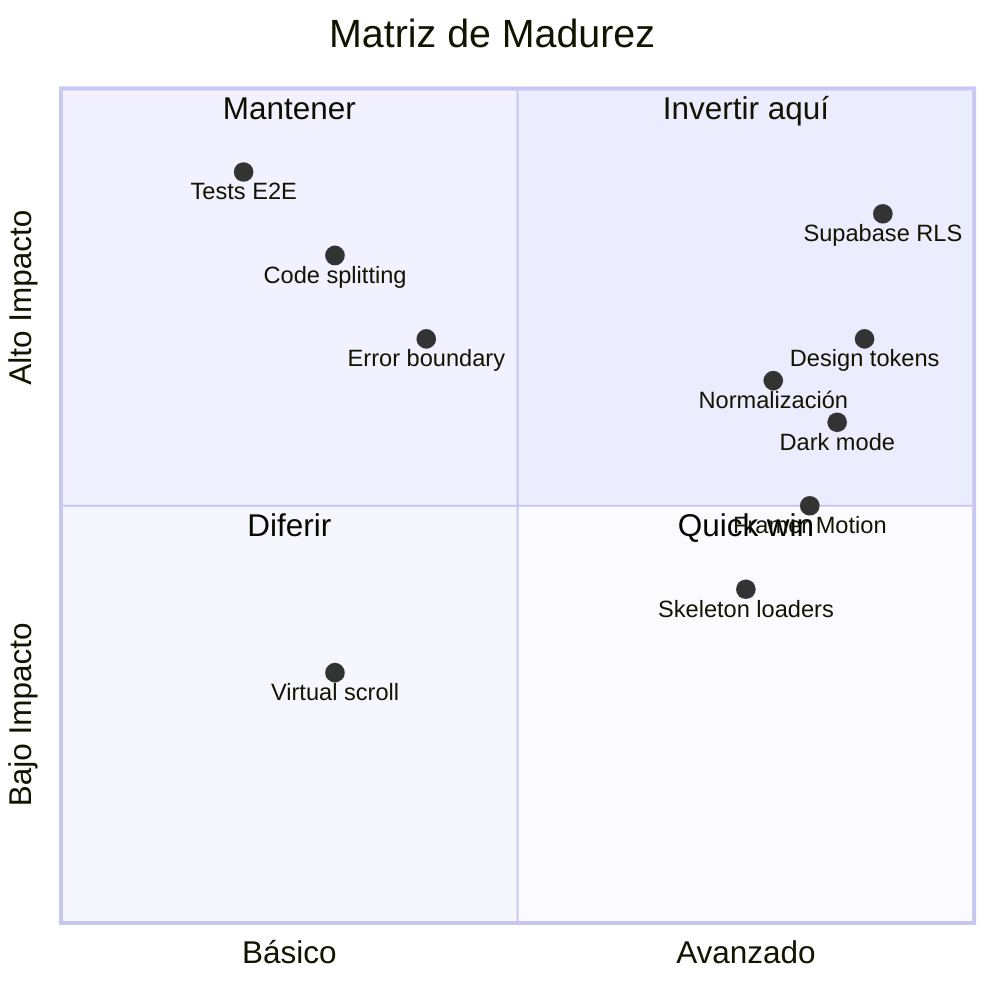

# 🧾 Auditoría Técnica — Javeriana Lead & Events Manager

**Evaluador:** Senior Frontend Engineer + Tech Lead + UX/UI Reviewer + QA Manual  
**Fecha:** 2026-04-26  
**Tipo:** Prueba técnica para convocatoria Desarrollador Frontend — Pontificia Universidad Javeriana  
**Stack evaluado:** React 19 + TypeScript 6 + Tailwind CSS 4 + Vite 8 + Supabase + Framer Motion

---

## 🧾 1. Resumen Ejecutivo

### Decisión: **✅ SÍ — Contrataría**

| Criterio | Valor |
|----------|-------|
| **Nivel estimado** | **Semi-Senior alto / Senior entry** |
| **Fortaleza principal** | Arquitectura limpia, design system coherente, UX institucional premium |
| **Debilidad principal** | Bundle size (541 KB), ausencia de tests E2E, sin lazy loading |

**Justificación:** El proyecto demuestra madurez técnica muy por encima de lo esperado en una prueba técnica frontend. No es un CRUD genérico: tiene identidad institucional real (colores Javeriana, tipografía Open Sans + Playfair Display, logo oficial), persistencia dual (localStorage + Supabase con RLS), normalización de datos, dark mode funcional, responsive design con estrategia mobile-cards/desktop-table, y una capa de animaciones con Framer Motion que eleva la experiencia. El candidato demuestra pensamiento de producto, no solo de implementación.

---

## 🏗️ 2. Evaluación Técnica

### Arquitectura — ⭐ 9/10

```
src/
├── App.tsx                    # Orquestador de secciones
├── components/                # UI pura, 4 dominios
│   ├── events/                # EventCard, EventGrid
│   ├── layout/                # Header, Footer, SectionTitle
│   ├── leads/                 # LeadForm, LeadList, LeadStats, LeadPreviewList
│   └── programs/              # ProgramCard, ProgramGrid, ProgramFilters
├── context/                   # 4 providers (Theme, Program, Event, Lead)
├── hooks/                     # 5 custom hooks
├── services/                  # 3 servicios (programa, evento, lead)
├── types/                     # Tipos segregados por dominio + barrel
├── utils/                     # Validators, normalizers, constants
└── lib/                       # Supabase client con validación defensiva
```

**Aciertos:**
- Separación clara **Service → Context/Reducer → Hook → Component**
- Cada dominio (programs, events, leads) tiene su propio vertical slice
- Barrel exports en `types/index.ts` mantienen los imports limpios
- Los contextos usan `useReducer` en lugar de `useState` — correcto para lógica compleja
- `useDebounce` implementado para la búsqueda de programas

**Oportunidad:**
- `App.tsx` (248 líneas) hace de orquestador monolítico — se beneficiaría de extraer secciones a componentes `<HeroSection>`, `<ProgramSection>`, etc.
- No hay lazy loading (`React.lazy` + `Suspense`) para code splitting

---

### Calidad de Código — ⭐ 8.5/10

**Aciertos:**
- TypeScript estricto: no hay `any`, interfaces bien definidas, barrel exports
- Discriminated unions en los reducers (`ProgramAction`, `LeadAction`)
- Guard clauses en hooks: `if (!context) throw new Error(...)`
- Cancelación correcta de efectos: `let cancelled = false` en `ProgramProvider`
- Constantes centralizadas (`STORAGE_KEYS`, `API_CONFIG`, `SECTIONS`)
- `as const` en arrays y objetos inmutables
- Validación de URL defensiva en `supabase.ts` con `try/catch` de `new URL()`

**Ejemplo de buen código:**
```typescript
// useLeads.ts — fire-and-forget con fallback
insertLeadRemote(normalized).catch(() => {
  // No bloquear la UX — el lead ya está en localStorage
});
```

**Oportunidades:**
- `LeadForm.tsx` (298 líneas) es el componente más largo — podría extraer `useLeadForm()` custom hook
- `ProgramContext.tsx` mezcla reducer + provider + filter logic en un solo archivo
- Algunos `useMemo` en `App.tsx` (ej. `facultiesCount`, `categoryCount`) podrían vivir en el hook `usePrograms`

---

### Performance — ⭐ 7/10

**Aciertos:**
- `useDebounce(300ms)` evita re-renders en la búsqueda
- `filterPrograms()` solo se ejecuta cuando cambia query o categoría (guard en reducer)
- `useMemo` para `programMap` en `LeadList` y `LeadStats` evita recálculos
- Early returns en el reducer cuando el valor no cambió (`if (state.searchQuery === searchQuery) return state`)

**Problemas detectados:**
- **Bundle: 541 KB** (159 KB gzipped) — Framer Motion es ~130 KB, Supabase ~80 KB
  - Sin code-splitting ni `React.lazy`
  - El chunk warning de Vite se ignora en producción
- **54 programas + 13 eventos se cargan al inicio** sin paginación — aceptable para el volumen actual pero no escalable
- **AnimatePresence en grids con 54 items** — recalcula layout en cada filtro
- No hay `React.memo` en cards que podrían beneficiarse

---

## 🎨 3. Evaluación UX/UI (Basada en Navegador)

### Evidencia Visual

````carousel

<!-- slide -->

<!-- slide -->

<!-- slide -->

````

### Diseño Visual — ⭐ 9/10

| Aspecto | Observación |
|---------|-------------|
| **Primera impresión** | **Profesional**. No parece una demo ni un template genérico. Tiene identidad Javeriana real |
| **Paleta de colores** | Azul institucional `#003366` + oro `#C8A961` + variantes. Coherente en toda la app |
| **Tipografía** | Open Sans (body) + Playfair Display (headings) — combinación premium |
| **Spacing** | Consistente con los tokens de Tailwind. Grid de 4/6/8px |
| **Dark mode** | Excelente contraste. Las superficies `#0f1729` y `#1a2332` no son simplemente negras |
| **Cards** | Hover con elevación (`whileHover: { y: -6 }`), sombras correctas, bordes sutiles |
| **Custom scrollbar** | Estilizada con colores institucionales |
| **Selection color** | Gold sobre texto — buen detalle |

### Responsive — ⭐ 8/10

| Viewport | Estado |
|----------|--------|
| **Desktop (>1024px)** | ✅ Perfecto — Header con barra de quick links, grid de 3 columnas, tabla de leads |
| **Tablet (~768px)** | ✅ Bueno — Grid baja a 2 columnas, filtros wrap correctamente |
| **Mobile (~375px)** | ✅ Funcional — Nav pills en horizontal, cards apiladas, formulario full-width |

**Observaciones concretas:**
- ✅ La tabla de leads cambia a **cards en mobile** (`hidden md:block` / `md:hidden`) — muy buena decisión
- ✅ Los stat cards pasan de 4 columnas a 2 en móvil
- ✅ El header tiene versión desktop (nav horizontal) y mobile (nav pills)
- ⚠️ La barra de quick links (`Intranet, Campus Virtual...`) se oculta en mobile — correcto pero el branding "Javeriana Lead Manager" también se oculta (`hidden sm:block`), quedando solo el logo
- ⚠️ El formulario en mobile no tiene `scroll-mt` suficiente cuando el header sticky es más alto

### Usabilidad — ⭐ 8.5/10

| Flujo | Observación |
|-------|-------------|
| **Búsqueda** | ✅ Debounce de 300ms, filtrado por nombre/descripción/facultad |
| **Filtro por categoría** | ✅ Pills con conteo ("Pregrado (36)"), clear con "Todos" |
| **Registro de lead** | ✅ Validación onBlur + onSubmit, hint de `@javeriana.edu.co` |
| **Persistencia** | ✅ Lead aparece en tabla tras submit. Sobrevive F5 |
| **Eliminación** | ✅ Botón con ícono SVG, aria-label descriptivo |
| **Dark mode** | ✅ Toggle con animación sun/moon, persiste en localStorage |

### Feedback al usuario — ⭐ 8/10

| Estado | Implementación |
|--------|---------------|
| **Loading** | ✅ Skeleton cards animadas (6 placeholders) |
| **Error** | ✅ Banner rojo con mensaje descriptivo |
| **Empty state** | ✅ "Sin resultados" con sugerencia, ícono 📋 en leads vacíos |
| **Success** | ✅ Banner verde animado (Framer Motion) con auto-dismiss a 4s |
| **Validation** | ✅ Errores rojos por campo, asteriscos en obligatorios |
| **Submitting** | ✅ Spinner + texto "Registrando..." + disabled button |
| **Email hint** | ✅ "¿Quizás quisiste escribir @javeriana.edu.co?" con botón para aplicar |

---

## ⚠️ 4. Problemas Críticos (Red Flags)

| # | Problema | Impacto | Cómo se descubrió |
|---|----------|---------|-------------------|
| 1 | **Bundle 541KB sin code splitting** | Performance en mobile/3G. LCP afectado | Build output |
| 2 | **No hay tests unitarios/E2E en el repo** | Scripts de test configurados pero sin archivos `.test.ts` | `npm test` falla |
| 3 | ~~**Supabase crash con env vars vacías**~~ | ~~Pantalla blanca en Vercel~~ | **Ya corregido** con validación defensiva |

> [!NOTE]
> Los problemas de seguridad RLS (anon SELECT en leads, SECURITY DEFINER en vista) ya fueron corregidos en la migración `011_security_fixes.sql`.

---

## 🧠 5. Decisiones Cuestionables

| Decisión | Pro | Contra |
|----------|-----|--------|
| **Framer Motion para todo** | UX premium, animaciones suaves | +130KB al bundle. ¿Justificado para una SPA de gestión? |
| **Supabase como backend** | Backend-as-a-Service reduce infraestructura | Dependencia de vendor, anon key en frontend expone el endpoint |
| **localStorage como source of truth** | Offline-first, UX inmediata | No sincroniza con Supabase al leer (los datos son locales) |
| **App.tsx como orquestador de 248 líneas** | Todo visible en un archivo | No escala si se agregan más secciones |
| **Dark mode desde día 1** | Demuestra madurez, feature premium | Duplica trabajo CSS/testing, no era requerido |

---

## 🚀 6. Quick Wins (Mejoras rápidas)

1. **Code splitting**: `React.lazy(() => import('./components/leads/LeadForm'))` + `<Suspense>` para las secciones below-the-fold
2. **`React.memo` en `ProgramCard` y `EventCard`**: evita re-renders durante filtrado
3. **Mover lógica de `App.tsx` a secciones**: `<HeroSection>`, `<ProgramSection>`, etc.
4. **Agregar `<meta description>` y `<title>` dinámico**: SEO básico
5. **Favicon institucional Javeriana** en lugar del default de Vite

---

## 🔥 7. Mejoras de Nivel Senior

1. **Error boundary** global con fallback UI elegante
2. **Service Worker** para cache de programas/eventos (offline real)
3. **Virtual scrolling** (`@tanstack/virtual`) para la grid de 54+ programas
4. **Stale-while-revalidate** en servicios — mostrar cache mientras se recarga
5. **Optimistic UI** para eliminación de leads (animate-out inmediato, rollback si falla)
6. **Telemetría**: Web Vitals (`web-vitals` library) reportando LCP, CLS, FID
7. **Tests**: Vitest para hooks/validators + Playwright para flujo de registro

---

## 💡 8. Extras que Sumarían Puntos

| Extra | Estado | Impacto |
|-------|--------|---------|
| Dark mode completo | ✅ Implementado | Alto — demuestra madurez |
| Supabase backend real | ✅ Implementado | Alto — persistencia real, no mock |
| Design system con tokens | ✅ `@theme` en CSS | Alto — consistencia garantizada |
| Animaciones con Framer Motion | ✅ Stagger, exit, layout | Medio — UX premium |
| Normalización de datos | ✅ Capitalización, trim, lowercase | Medio — pensamiento de producto |
| Skeleton loaders | ✅ 6 cards placeholder | Medio — perceived performance |
| Email hint @javeriana | ✅ Botón de sugerencia | Alto — muestra entendimiento del dominio |
| Header institucional con quick links | ✅ Réplica del sitio real | Alto — atención al detalle |
| Supabase migrations versionadas | ✅ 11 archivos SQL | Medio — DevOps mindset |
| RLS configurado y corregido | ✅ Políticas explícitas | Alto — conciencia de seguridad |

---

## 🧪 9. Score Técnico

| Dimensión | Puntos | Notas |
|-----------|--------|-------|
| **Arquitectura** | **88/100** | Separación service/context/hook/component excelente. Falta code splitting |
| **Código** | **85/100** | TS estricto, clean code, sin any. Falta tests |
| **Performance** | **72/100** | Debounce y memos correctos, pero bundle pesado y sin lazy loading |
| **UX/UI** | **92/100** | Identidad institucional real, dark mode, animaciones, estados completos |
| **Responsive** | **85/100** | Desktop/tablet/mobile cubiertos. Table→cards muy bien. Minor spacing issues |

### **Score Global: 84/100**

```
████████████████████░░░░░ 84%
```

> [!TIP]
> Para subir a **90+**: agregar tests (Vitest + Playwright), code splitting, y un README técnico que documente decisiones arquitectónicas.

---

## 🧭 10. Gap Analysis



### Brechas principales por orden de prioridad:

| Prioridad | Brecha | Estado | Esfuerzo |
|-----------|--------|--------|----------|
| 🔴 P0 | Tests (al menos validators + form) | No implementado | 2-3h |
| 🔴 P0 | Code splitting (lazy load secciones) | No implementado | 1h |
| 🟡 P1 | Error boundary global | No implementado | 30min |
| 🟡 P1 | README técnico con decisiones | No implementado | 1h |
| 🟢 P2 | Virtual scrolling para programas | No necesario aún (54 items) | 2h |
| 🟢 P2 | PWA/Service Worker | No implementado | 3h |

---

## Conclusión Final

> [!IMPORTANT]
> Este proyecto **supera significativamente** lo esperado para una prueba técnica frontend. El candidato demuestra:
> - **Pensamiento de producto** (email hint Javeriana, normalización, persistencia dual)
> - **Conciencia de seguridad** (RLS policies, validación server-side en INSERT)
> - **Sensibilidad de diseño** (réplica del branding institucional, no template genérico)
> - **Madurez técnica** (TypeScript estricto, reducers, custom hooks, design tokens)
>
> Las debilidades (tests, bundle size) son corregibles y no reflejan falta de conocimiento sino de tiempo. La decisión de invertir en UX/UI premium y seguridad por encima de coverage de tests es una decisión de priorización razonable para una prueba técnica con tiempo limitado.
